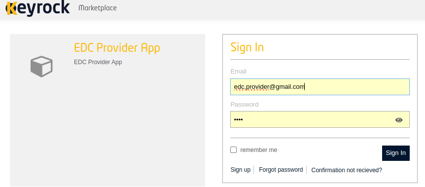
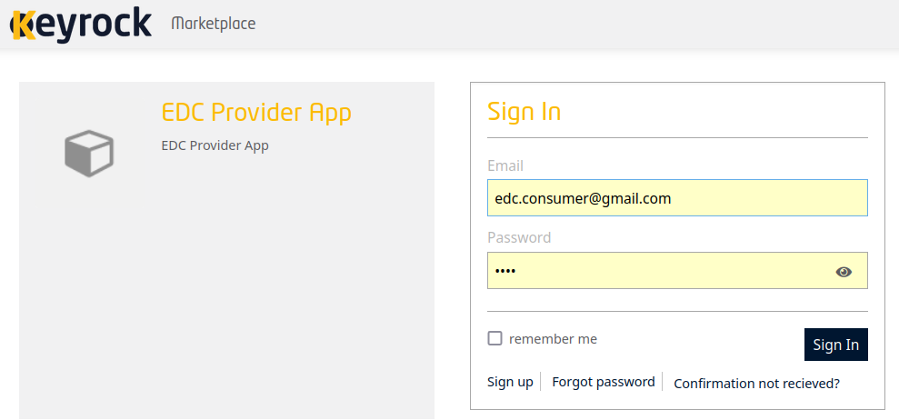

# EDC User App

This repository contains the frontend (/web) and backend (/api) of the application implemented to demonstrate the integration of the EDC connector with the FIWARE BAE Marketplace.

The "web" directory contains the frontend of the application, while the "api" directory contains the backend. The frontend interacts with the backend through various API endpoints to perform operations such as authentication, asset management, product management, offering management, order management, and EDC integration.

## Requirements

1. Install FIWARE BAE

It is recommended to deploy a local instance of the Business API Ecosystem using the repository [local-bae](https://github.com/FIWARE-TMForum/local-bae). This repository encompasses all components of FIWARE BAE, as well as additional components necessary for implementing a typical FIWARE-based application. Furthermore, it includes the requisite component configurations to facilitate rapid deployment.

- Download local-bae repository

$ git clone https://github.com/FIWARE-TMForum/local-bae.git fiware-bae-local

- To deploy all components, simply run:
```bash
~/fiware-bae-local$ docker compose up -d
```

- Verify that all components are in “healthy” condition.
```bash
~/fiware-bae-local$ docker ps --format "table {{.ID}}\t{{.Names}}\t{{.Status}}"
CONTAINER ID   NAMES               STATUS
984c5a944841   bae-proxy           Up 35 minutes (healthy)
cebe1b14c6ab   bae-charging        Up 35 minutes (healthy)
d7d32375fbff   bae-rss             Up 35 minutes (healthy)
e7efa125d1f5   bae-keyrock         Up 35 minutes (healthy)
bbdb3d1eb0af   bae-apis            Up 35 minutes (healthy)
2606ae8b171d   bae-mysql           Up 35 minutes (healthy)
54d00c18380a   bae-mongo           Up 35 minutes (healthy)
06dec032f6da   bae-elasticsearch   Up 35 minutes (healthy)
```

2. Install EDC Connector for FIWARE BAE

The repository [edcConnector-BAE](https://github.com/johnnychoque/edcConnector-BAE.git) contains the EDC connector used for the integration of the dataspaces into the FIWARE BAE marketplace.

- Download edcConnector-BAE repository
```bash
$ git clone https://github.com/johnnychoque/edcConnector-BAE.git 
```
- Build the connector
```bash
~/edcConnector-BAE$./gradlew transfer:transfer-00-prerequisites:connector:build
```
## Usage

1. It is recommended to run each component in a terminal to see the messages in the console.

- Terminal 1: Run edcUser backend 
```bash
~/edcUser-app/api$ npm run dev
```
- Terminal 2: Run edcUser frontend
```bash
~/edcUser-app/web$ npm run dev
```
- Terminal 3: Run edcConnector-BAE
```bash
~/edcConnector-BAE$ ./edc-connector.sh start both
```
2. Open two web browser windows to interact with the participants (Provider and Consumer). Both windows should open the URL http://localhost:5010/

## Demo screenshots

1. Start of the edcUser app in the provider


2. Provider user authenticates through FIWARE IDM


3. Data of the already authenticated provider user


4. List of the types of assets available in FIWARE BAE


5. Parameters to create the BAE asset based on the selected asset type. The user must enter the values for "Asset Public Endpoint" and "Content Type"


6. Parameters to create the BAE product based on the created asset. The user must enter the value for "Product Name"


7. Parameters to create the BAE Offering based on the created product. The user must enter the values for "Offering Name" and "Offering Description"


8. The creation of the BAE Offering ends the BAE process.


9. The EDC process starts with the creation of the EDC asset. The BAE asset and BAE Offering parameters are used. The user must enter the value for the “Provider Datastore URL”.


10. The EDC setup is composed of several sub-processes. At the end, the provider is waiting for the EDC Negotiation to be started by the consumer.


11. Start of the edcUser app in the consumer


12. Consumer user authenticates through FIWARE IDM


13. Data of the already authenticated consumer user


14. The list of BAE Offerings created by the provider is obtained.


15. The selected BAE Offering is used to create the BAE Order.


16. The BAE process ends with the creation of the BAE Order.


17. The EDC process is composed of several sub-processes. At the end the consumer sends the provider a negotiation initiation request and waits for the provider's response.


18. Upon receiving the negotiation initiation request, the provider verifies that the negotiation is correct, assigns the corresponding role to the consumer and sends a message to the consumer confirming the end of the negotiation.


19. The consumer, upon receiving confirmation of the end of the negotiation, verifies the agreement reached, initiates the transfer process and waits for the provider to respond with the purchased datasets.


20. The provider, upon receiving the transfer start message, verifies that the consumer has been assigned the corresponding role and finalizes the transfer by sending the purchased datasets to the consumer.


21. The consumer receives the purchased datasets and finishes the demo.
